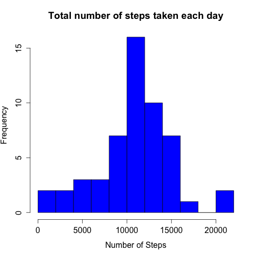
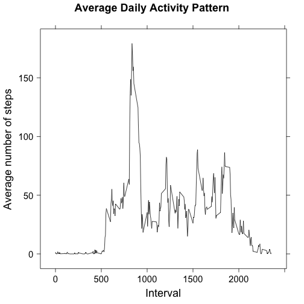
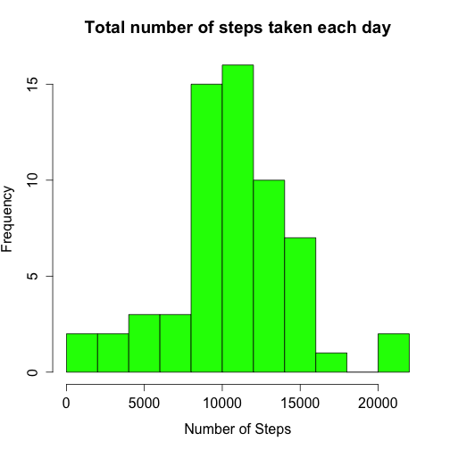
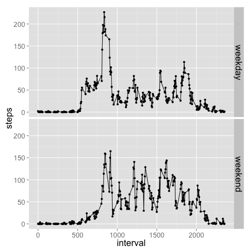

# Reproducible Research: Peer Assessment 1

## Loading and preprocessing the data

```r
data <- read.csv("./activity.csv", colClasses = c("numeric", "Date", "numeric"))
```


## What is mean total number of steps taken per day?
### Histogram of mean total number of steps per day

```r
stepsxday <- aggregate(steps ~ date, data = data, FUN = "sum", na.action = na.omit)
steps_mean <- mean(stepsxday$steps)
steps_median <- median(stepsxday$steps)
par(ps = 16)
hist(stepsxday$steps, xlab = "Number of Steps", breaks = 10, col = "blue", main = "Total number of steps taken each day")
```

 


The mean of the total number of steps taken each day is 10766.19, while the median is 10765.

## What is the average daily activity pattern?

```r
library(lattice)
nintervals <- 24 * 60/5
ndays <- nrow(data)/nintervals
stepsxinterval <- aggregate(steps ~ interval, data = data, FUN = "sum")
names(stepsxinterval) <- c("interval", "mean_steps")
stepsxinterval$mean_steps <- stepsxinterval$mean_steps/ndays
max_interval <- stepsxinterval$interval[which.max(stepsxinterval$mean_steps)]

ylabspec <- list(label = "Average number of steps", cex = 1.5)
xlabspec <- list(label = "Interval", cex = 1.5)
mspec <- list(label = "Average Daily Activity Pattern", cex = 1.5)
xyplot(mean_steps ~ interval, data = stepsxinterval, type = "l", xlab = xlabspec, 
    ylab = ylabspec, col = "black", main = mspec, scales = list(cex = 1.25))
```

 

The 5-minute interval that contains the maximum number of steps is 835.

## Imputing missing values

```r
idx <- is.na(data$steps)
n_missval <- sum(idx)
```

The total number of missing values in the data set is 2304.

In the following piece of code we fill the missing values with the mean steps of each 5-minutes interval.

```r
data2 <- data
for (i in 1:length(idx)) {
    if (idx[i] == TRUE) {
        intval <- data2$interval[i]
        data2$steps[i] <- stepsxinterval$mean_steps[which(stepsxinterval$interval == 
            intval)]
    }
}
```


Then we extract the data for the histogram with filled missing values

```r
stepsxday2 <- aggregate(steps ~ date, data = data2, FUN = "sum")
steps_mean2 <- mean(stepsxday2$steps)
steps_median2 <- median(stepsxday2$steps)
par(ps = 16)
hist(stepsxday2$steps, xlab = "Number of Steps", breaks = 10, col = "green", 
    main = "Total number of steps taken each day")
```

 

When we include the missing values the mean of the total number of steps taken each day is 10581.01 and the median is 10395. As expected, the value of these variables decreases when we fill the missing values with some sort of average due to the increased number of measurements used for their estimation.


## Are there differences in activity patterns between weekdays and weekends?
First we create the factor variable "weekday" and "weekend".

```r
data2 <- cbind(data2, factor(as.numeric(weekdays(data2$date) %in% c("Saturday", 
    "Sunday")), labels = c("weekday", "weekend")))
names(data2)[4] <- "daytype"
```


Then we plot the two different panels of the activity pattern.

```r
n_weekdays <- sum(data2$daytype == "weekday")/nintervals
n_weekends <- sum(data2$daytype == "weekend")/nintervals
steps_weend <- aggregate(steps ~ interval + daytype, data = data2, FUN = "sum")

idx <- steps_weend$daytype == "weekday"
steps_weend$steps[idx] <- steps_weend$steps[idx]/n_weekdays
idx <- !idx
steps_weend$steps[idx] <- steps_weend$steps[idx]/n_weekends

library(ggplot2)
g <- qplot(x = interval, y = steps, data = steps_weend, facets = daytype ~ .)
g + theme(axis.text = element_text(size = 14), axis.title = element_text(size = 18), 
    strip.text = element_text(size = 18)) + geom_line()
```

 


